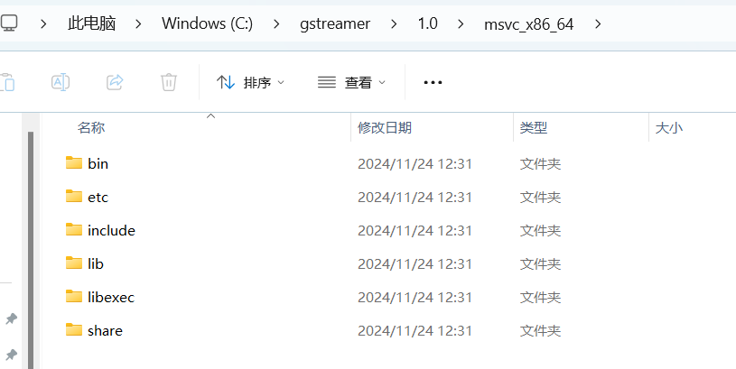
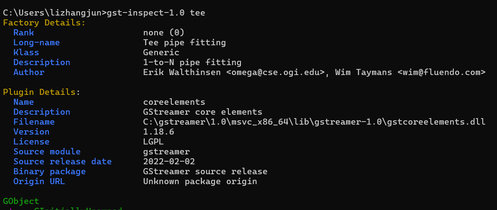
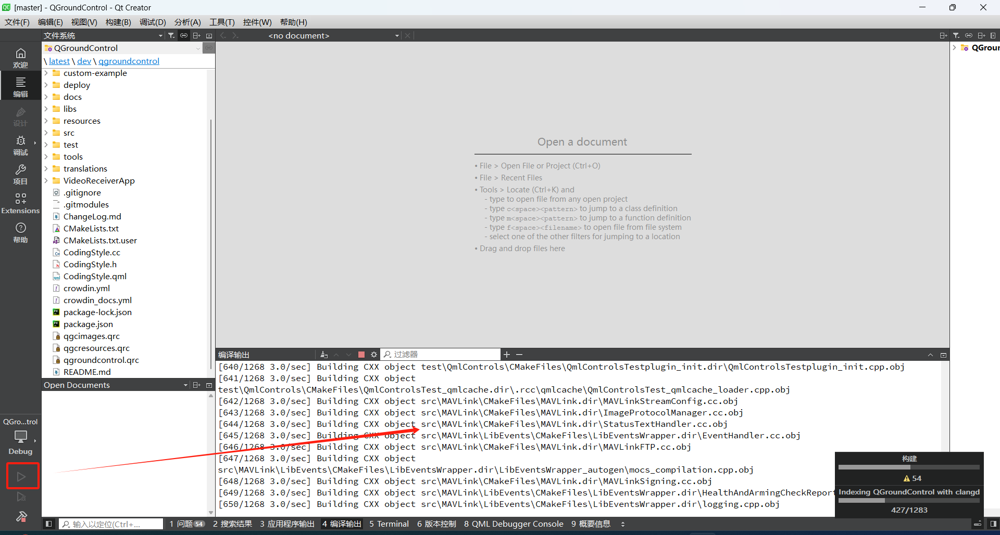
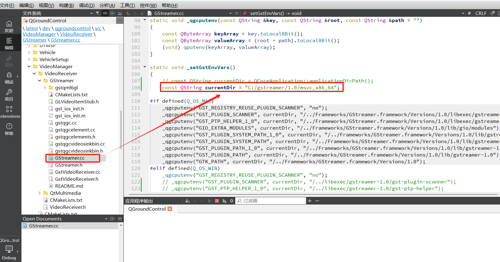

<p align="center">
  
</p>

<p align="center">
  <a href="https://github.com/mavlink/QGroundControl/releases">
    
  </a>
</p>

*QGroundControl* (QGC) is a highly intuitive and powerful Ground Control Station (GCS) designed for UAVs. Whether you're a first-time pilot or an experienced professional, QGC provides a seamless user experience for flight control and mission planning, making it the go-to solution for any *MAVLink-enabled drone*.

---
### 编译运行
#### 克隆代码
```
 git clone --recursive https://github.com/50ke/qgroundcontrol.git
 cd qgroundcontrol/
 git submodule update --recursive
```
#### 环境安装
- QT: 6.6.3
- 编译器: MSVC 2019（下载地址：https://aka.ms/vs/16/release/vs_community.exe）
- 操作系统: Windows10/11
#### Gstreamer安装
- 创建目录: C:\gstreamer
- 下载地址: https://gstreamer.freedesktop.org/data/pkg/windows/1.18.6/msvc/
- 安装文件: gstreamer-1.0-msvc-x86_64-1.18.6.msi 和 gstreamer-1.0-devel-msvc-x86_64-1.18.6.msi
- 将【安装文件】复制到C:\gstreamer并打开powershell
- 执行命令: msiexec /passive INSTALLLEVEL=1000 INSTALLDIR=C:\gstreamer /i gstreamer-1.0-msvc-x86_64-1.18.6.msi
- 执行命令: msiexec /passive INSTALLLEVEL=1000 INSTALLDIR=C:\gstreamer /i gstreamer-1.0-devel-msvc-x86_64-1.18.6.msi
- 系统环境变量设置
```
GST_PLUGIN_PATH > C:\gstreamer\1.0\msvc_x86_64\lib\gstreamer-1.0

GSTREAMER_ROOT_X86_64 > C:\gstreamer\1.0\msvc_x86_64

Path > C:\gstreamer\1.0\msvc_x86_64\bin
```
- 安装检查: cmd执行 gst-inspect-1.0 tee


#### 编译构建
- 打开qtcreator
- 打开项目qgroundcontrol/CMakeLists.txt
- 编译运行

#### 注意事项
- 如果gstreamer安装在其他路径，需要修改以下文件: 

#### 打包发布

---

### 🌟 *Why Choose QGroundControl?*

- *🚀 Ease of Use*: A beginner-friendly interface designed for smooth operation without sacrificing advanced features for pros.
- *✈️ Comprehensive Flight Control*: Full flight control and mission management for *PX4* and *ArduPilot* powered UAVs.
- *🛠️ Mission Planning*: Easily plan complex missions with a simple drag-and-drop interface.

🔍 For a deeper dive into using QGC, check out the [User Manual](https://docs.qgroundcontrol.com/en/) – although, thanks to QGC's intuitive UI, you may not even need it!


---

### 🚁 *Key Features*

- 🕹️ *Full Flight Control*: Supports all *MAVLink drones*.
- ⚙️ *Vehicle Setup*: Tailored configuration for *PX4* and *ArduPilot* platforms.
- 🔧 *Fully Open Source*: Customize and extend the software to suit your needs.

🎯 Check out the latest updates in our [New Features and Release Notes](https://github.com/mavlink/qgroundcontrol/blob/master/ChangeLog.md).

---

### 💻 *Get Involved!*

QGroundControl is *open-source*, meaning you have the power to shape it! Whether you're fixing bugs, adding features, or customizing for your specific needs, QGC welcomes contributions from the community.

🛠️ Start building today with our [Developer Guide](https://dev.qgroundcontrol.com/en/) and [build instructions](https://dev.qgroundcontrol.com/en/getting_started/).

---

### 🔗 *Useful Links*

- 🌐 [Official Website](http://qgroundcontrol.com)
- 📘 [User Manual](https://docs.qgroundcontrol.com/en/)
- 🛠️ [Developer Guide](https://dev.qgroundcontrol.com/en/)
- 💬 [Discussion & Support](https://docs.qgroundcontrol.com/en/Support/Support.html)
- 🤝 [Contributing](https://dev.qgroundcontrol.com/en/contribute/)
- 📜 [License Information](https://github.com/mavlink/qgroundcontrol/blob/master/.github/COPYING.md)

---

With QGroundControl, you're in full command of your UAV, ready to take your missions to the next level.
